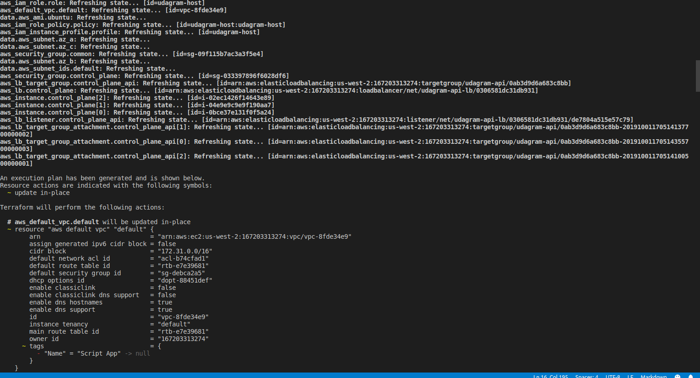
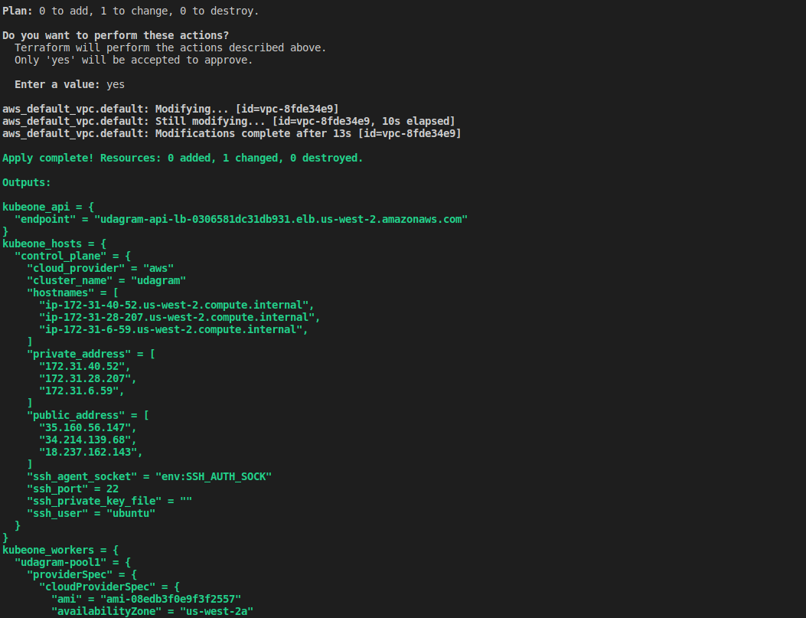
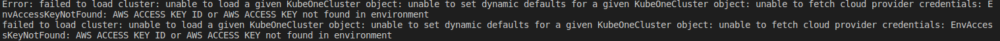

# Project Difficulties

This project has been very interestin so far and I managed to run the the different servers on my local machine directly and also succeded to deploy the docker images and also run the servers simulaneously from docker.

However, after several confguration and trial, I was unable to deploy the application on the kubernets cluster created either locally or on aws. 

I used terraform and kubeone to help achieve this deployment but after the succesful creation of the instance on aws with the help of terraform,I have been unable to install kubernetes on the aws instance. 

I get the following error below when running the command `kubeone install config.yaml -t tf.json`

With this I have not been able to proceed with the kubenetes deployment and will like some more explaination of how this process is done since I did not get as much information from the lessons.

### Solutions

- I used the default kubeone aws configs from ...
- I created an ssh public key with the command ssh-keygen 
- i saved the key in ~/.ssh/ 
- now i ran the terraform commands
