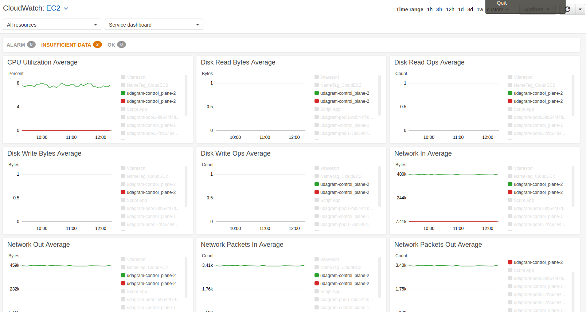
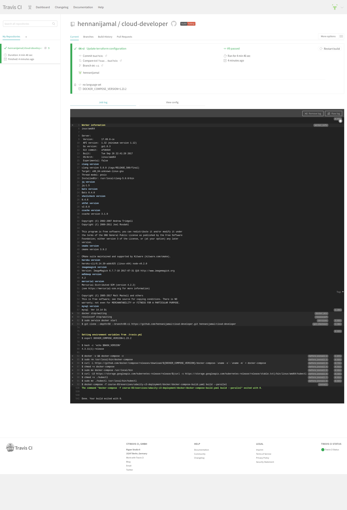
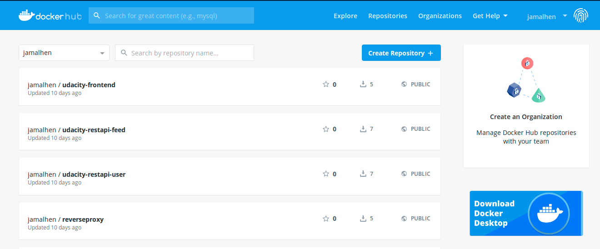

# Refactor Udagram app into Microservices and Deploy

=============================================================================================================================

## Submission Note

Thanks to the previous Reviewer the tips given it has helped to finish up the project.

Here is a screensgot of the application on Amazon Cloudwatch:

===============================================================================================================================

My completed project repo is founf in the link https://github.com/hennanijamal/cloud-developer/tree/06-ci/course-03/exercises

## How to Run Project

To run the project, clone the repo from my branch with the command.

` git clone -b 06-ci https://github.com/hennanijamal/cloud-developer.git`

- To install the node dependencies for the frontend, 
    - navigate to the directory ***cloud-developer/course-03/exercises/udacity-c3-frontend***
    - run the command `npm install`
    - If you don't haver ionic setup on your system, run `npm install -g ionic`
    - You can run a test on the frontend with the command `npm test`
    - You can startup the front end application locally with the command `ionic serve`

- Also install the node dependencies of the feed restapi.
    - navigate to the directory ***cloud-developer/course-03/exercises/udacity-c3-resapi-feed***
    - run the command `npm install`
    - This can be run locally with the command `npm run dev`

- Install the node dependencies of the user restapi.
    - navigate to the directory ***cloud-developer/course-03/exercises/udacity-c3-resapi-user***
    - run the command `npm install`
    - This can be run locally with the command `npm run dev`

- I created the dev branch which will hold the final deployment of my project in production.

## Travis Build 

Below is and image showing the build of my application build with [Travis CI ](https://travis-ci.org/hennanijamal/cloud-developer)

## Setup Docker Environment

You'll need to install docker https://docs.docker.com/install/.

To create, deploy and run the docker images, I simply used the `docker-compose up` command.

- Navigate to the directory ***cloud-developer/course03/exercises/udacity-c3-deployement/docker***

- Open a new terminal within the above mentioned docker directory and run:

    1. Build the images: `docker-compose -f docker-compose-build.yaml build --parallel`
    2. Push the images: `docker-compose -f docker-compose-build.yaml push`
    3. Run the container: `docker-compose up`

### Run App on Docker
- Open on the browers the link `localhost:8100`

Below is an image of my deployment of my images to  [docker hub](https://hub.docker.com/u/jamalhen) 

## Setup kubernetes clusters

Install and setup kubeone and terraform

- navigate to the directory ***cloud-developer/course03/exercises/udacity-c3-deployement/k8s***

### Creating AWS infrastructure
- Open a new terminal from this directory and run the following command:
    1. Initialize terraform: `terraform init`
    2. `terraform plan`
    3. `terraform apply`
    4. `terraform output -json > tf.json`
  
### Installing kubernetes
- Verify kubeone installation: `kubeone config print --full`
- Copy configuration: `kubeone config print > config.yaml`
- Install kubernetes cluster: `kubeone install config.yaml --tfjson tf.json`
- Get Kubeconfig file: `kubectl --kubeconfig=<cluster_name>-kubeconfig`
- export the KUBECONFIG variable environment variable: `export KUBECONFIG=$PWD/<cluster_name>-kubeconfig` 

### Deploying to kuberbetes
- `kubectl apply -f backend-feed-deployment.yaml`
- `kubectl apply -f backend-user-deployment.yaml`
- `kubectl apply -f frontend-deployment.yaml`
- `kubectl apply -f reverseproxy-deployment.yaml`

### Adding configurations
- `kubectl apply -f aws-secret.yaml`
- `kubectl apply -f env-configmap.yaml`
- `kubectl apply -f env-secret.yaml`

### Run Kubernetes application on local machine

- Verify pods: kubectl get pod
- Run reverseproxy server: `kubectl port-forward pod/reverseproxy-xxxxx-xx 8080:8080`
- Run frontend: `pod/frontend-xxxxxx-xxxx 8100:8100`

### Deploy services on Kubernetes
- `kubectl apply -f backend-feed-service.yaml`
- `kubectl apply -f backend-user-service.yaml`
- `kubectl apply -f frontend-service.yaml`
- `kubectl apply -f reverseproxy-service.yaml`
